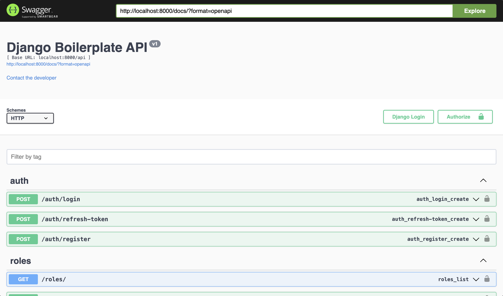

# Django REST framework template

<p align="center">
  <a href="https://www.django-rest-framework.org/" target="blank"></a>
</p>


## Prerequisites
- [Python](https://www.python.org/) v3.10+
- [PostgreSQL](https://www.postgresql.org/)

## Setup local development
### Setup virtual environment
In side the `django-templates` apply these following commands
```bash
# Create virtual env
python -m venv venv

# Activate the venv
# On window
.\venv\Scripts\activate

# On MacOs
source ./venv/bin/activatee

# Deactivate the venv
deactivate
```
### Setup dependencies & environment

1. Install dependencies
```bash
pip install -r requirements.txt
```
2. Update database information in `boilerplate/settings/local.py` or copy `.env.example` into `.env`
   
### Setup database
1. Init database
```bash
docker compose up -d db
```

2. Migrate database
```bash
python manage.py makemigrations
python manage.py migrate
```

3. Seed the data
```bash
python manage.py loaddata boilerplate/database/seed.json
```   

### Run up the server 
```bash
python manage.py runserver 0.0.0.0:8000
```

### Or you can just use docker compose
```bash
docker compose up -d init_dev
```

### 🐞 Fix bugs docker: If the services cannot run synchronously you can try run the them in the following order
```bash
docker compose up -d db
docker compose up -d init_dev
```
 
Open browser and access `localhost:8000/docs` to view swagger documentation

<p align="center">
  <a href="#" target="blank"></a>
</p>

